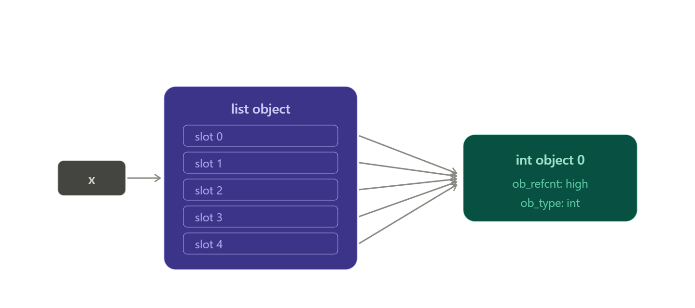

# The `[0] * 3` Trap in Python Lists

Please first read [1D & 2D List Memory Representation](./1d_2d_list_memory_representation.md). That page explains the pointer-based model behind Python lists, which makes this topic much easier to understand.

This note explains one of the most common Python surprises:

`[0] * 3` looks like it creates three independent values, but it actually repeats references.

That same rule is what makes `[[0] * 3] * 3` behave like a trap.

---

## 1) What `[0] * 3` really means

When you write `[0] * 3`, Python does **not** create three new integer objects with value `0`.

It creates one list and repeats the reference to the same immutable integer object.

```txt
Conceptually:

[0]
 │
 ▼
┌─────────┐
│ ptr[0] ───────► integer object 0
└─────────┘

After [0] * 3, you get:

┌─────────┬─────────┬─────────┐
│ ptr[0]  │ ptr[1]  │ ptr[2]  │
└────┬────┴────┬────┴────┬────┘
     │         │         │
     └─────────┼─────────┘
               │
               ▼
          ┌────────────┐
          │ int object │
          │ value = 0  │
          └────────────┘
```

### Why this matters

Python integers, floats, and strings are immutable. So instead of cloning the object, list multiplication repeats references to the same object.

If you want to visualize it at the CPython level, think of a list as a `PyListObject` that stores pointers in `ob_item`, not the raw values themselves.

`x = [0] * 5` means:

- `x` points to a `PyListObject`.
- `PyListObject.ob_item` points to an array of slots.
- Each slot points to the same integer object `0`.

> Note: no new `0` object is created here. Only the references are repeated.



---

## 2) The famous trap: `[[0] * 3] * 3`

At first glance, this looks like a 3×3 matrix:

```txt
[
[0, 0, 0],
[0, 0, 0],
[0, 0, 0]
]
```

But that expectation is wrong. There are not three independent rows. There is one row object repeated three times.

### Step 1: create one row

Python first evaluates `[0] * 3`:

```txt
row
 │
 ▼
┌─────────┬─────────┬─────────┐
│ ptr[0]  │ ptr[1]  │ ptr[2]  │
└────┬────┴────┬────┴────┬────┘
     │         │         │
     └─────────┼─────────┘
               ▼
               0
```

Let’s call that list `ROW A`:

```txt
ROW A
│
├── ptr[0] ──► 0
├── ptr[1] ──► 0
└── ptr[2] ──► 0
```

### Step 2: repeat the row reference

Now Python evaluates `[row] * 3`.

The thing being multiplied is **not** the contents of `ROW A`. It is a list that contains a reference to `ROW A`.

```txt
Initially [row] is:

Outer list
│
└── ptr[0] ─────────► ROW A
```

After `* 3`, the outer list has three pointers, but all of them point to the same inner list.

```txt
Outer list

┌─────────┬─────────┬─────────┐
│ ptr[0]  │ ptr[1]  │ ptr[2]  │
└────┬────┴────┬────┴────┬────┘
     │         │         │
     └─────────┼─────────┘
               │
               ▼
          ┌──────────────┐
          │    ROW A     │
          │              │
          │ 0   0   0    │
          └──────────────┘
```

**This is the trap:** the outer list has three pointers, but all three pointers point to the same inner list.

---

## 3) Complete memory picture

```txt
x = [[0] * 3] * 3

                         x
                         │
                         ▼
              ┌───────────────────────┐
              │     OUTER LIST        │
              │                       │
              │  ob_size = 3          │
              │                       │
              │  ptr[0] ──────────┐   │
              │  ptr[1] ──────┐   │   │
              │  ptr[2] ──┐   │   │   │
              └───────────┼───┼───┼───┘
                          │   │   │
                          │   │   │
                          └───┼───┼─────────┐
                              │   └──────┐   │
                              │          │   │
                              ▼          ▼   ▼
                         ┌────────────────────────┐
                         │       ROW A            │
                         │     PyListObject       │
                         │                        │
                         │ ptr[0] ───────► 0      │
                         │ ptr[1] ───────► 0      │
                         │ ptr[2] ───────► 0      │
                         └────────────────────────┘

Simplified:

x
│
▼
OUTER LIST
│
├──────── ptr[0] ───────┐
├──────── ptr[1] ───┐   │
└──────── ptr[2] ┐  │   │
                 │  │   │
                 ▼  ▼   ▼
                ┌──────────────┐
                │ SAME ROW     │
                │              │
                │ [0, 0, 0]    │
                └──────────────┘
```

> The catch: there are not three rows. There is one row with three references to it.

---

## 4) What happens when you assign `x[0][1] = 99`

Now the behavior becomes obvious.

First, `x[0]` returns the shared inner list.

```txt
x[0] ──┐
x[1] ──┼──► SAME LIST
x[2] ──┘
```

So `x[0]`, `x[1]`, and `x[2]` are literally the same object.

When you run `x[0][1] = 99`, you modify that one shared list.

Before:

```txt
x

x[0] ──┐
x[1] ──┼──► [0, 0, 0]
x[2] ──┘
```

After:

```txt
x

x[0] ──┐
x[1] ──┼──► [0, 99, 0]
x[2] ──┘
```

Therefore, `print(x)` gives:

```py
[[0, 99, 0],
 [0, 99, 0],
 [0, 99, 0]]
```

It looks like three rows changed, but only one list changed. All three outer positions were pointing at it.

---

## 5) The `id()` experiment

This makes the aliasing undeniable:

```py
x = [[0] * 3] * 3

print(id(x[0]))
print(id(x[1]))
print(id(x[2]))

"""
Output is identical:
2185074241344
2185074241344
2185074241344
"""
```

Because `x[0] is x[1]` is `True`, and `x[1] is x[2]` is also `True`. So `x[0] is x[1] is x[2]` is `True`.

---

## 6) The correct way to create a 3×3 matrix

If you want three different inner lists, use a list comprehension:

```py
x = [[0] * 3 for _ in range(3)]
```

This is fundamentally different because the list multiplication happens inside each iteration.

- Iteration 1: `[0] * 3` creates `ROW A → [0, 0, 0]`.
- Iteration 2: `[0] * 3` creates a new list, `ROW B → [0, 0, 0]`.
- Iteration 3: `[0] * 3` creates another new list, `ROW C → [0, 0, 0]`.

### Correct 2D memory diagram

```txt
                         x
                         │
                         ▼
              ┌─────────────────────────┐
              │      OUTER LIST         │
              │                         │
              │ ptr[0] ───────────────┐ │
              │ ptr[1] ────────┐      │ │
              │ ptr[2] ──┐     │      │ │
              └──────────┼─────┼──────┼─┘
                         │     │      │
                         ▼     ▼      ▼
                      ┌────┐ ┌────┐ ┌────┐
                      │ROW │ │ROW │ │ROW │
                      │ A  │ │ B  │ │ C  │
                      └─┬──┘ └─┬──┘ └─┬──┘
                        │      │      │
                        ▼      ▼      ▼

                     ROW A   ROW B   ROW C
                   ┌──────┐ ┌──────┐ ┌──────┐
                   │ptr ──┼►│ptr ──┼►│ptr ──┼►
                   │ptr ──┼►│ptr ──┼►│ptr ──┼►
                   │ptr ──┼►│ptr ──┼►│ptr ──┼►
                   └──────┘ └──────┘ └──────┘
                      │        │        │
                      ▼        ▼        ▼
                    0 0 0    0 0 0    0 0 0

Each row is a list, and each list has its own `PyListObject`. That means `ob_item` points to a different pointer array for each row.
```

---

## 7) The deeper principle

Sequence repetition is shallow. It repeats references to elements; it does not recursively clone the objects those references point to.

That is why this problem is not limited to matrices. The same issue appears with any mutable object.

For example:

```py
a = [[1, 2]] * 3
a = [{"x": 10}] * 3
```

Both create repeated references to the same inner object.

---

## 8) A simple mental model

Think of Python 2D lists as a pointer graph.

### Correct matrix

```txt
                         x
                         │
                         ▼
                    OUTER LIST
                   /     |     \
                  /      |      \
                 ▼       ▼       ▼
              ROW A    ROW B    ROW C
              / | \    / | \    / | \
             ▼  ▼  ▼  ▼  ▼  ▼  ▼  ▼  ▼
             0  0  0  0  0  0  0  0  0
```

### Trap matrix

```txt
                         x
                         │
                         ▼
                    OUTER LIST
                   /     |     \
                  /      |      \
                 └───────┼───────┘
                         ▼
                       ROW A
                      /  |  \
                     ▼   ▼   ▼
                     0   0   0
```

Three outer pointers. One row.

> If multiple references point to the same mutable object, modifying that object through one reference is visible through all references.